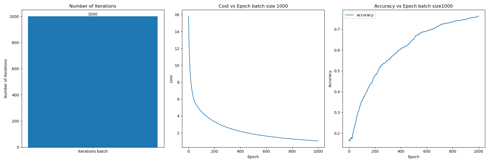

# Discussion

## Backpropagation

Before training the accuracy is around 14% percent. This is normal as the model is doing random guesses and the probability that it does the correct guess is around 1/7 because there is an uniform distribution between the 7 classes. It doesn't know anything and it's going to choose a class with a probability for it to be correct between 1/7.

After the model is trained, the probability significatively increases to be around 70% after 1000 updates in batch training (one update after seeing the whole dataset once). Not only the accuracy increases but also the loss decreases showing that the model is indeed learning by optimizing the loss (difference between predictions and real labels)

.

## Mini-batch and Stochastic Gradient Descent

Mini-batch and SGD traning worked significantly better than batch training as there were more weight updates than in batch training while seeing the whole dataset. Mini-batch training and SGD introduce also randomness while seeing randomized parts of the dataset before every update. However, mini-batch and SGD were significantly slower as the number of iterations increase. 
In the case of SGD, there is for example one iteration for every datapoint. So many iterations as datapoints times epochs.

.